# Analysis 1 — WGBS Bisulfite Sequencing Pipeline

> Whole-genome bisulfite sequencing analysis of breast cancer and normal breast tissue methylomes.  
> **Data:** Lin et al. (2015) · **Platform:** Galaxy Europe · **Reference:** hg38 (GRCh38)

[](https://usegalaxy.eu)
[](https://training.galaxyproject.org/training-material/topics/epigenetics/tutorials/methylation-seq/tutorial.html)

---

## Table of Contents

- [Biological Rationale](#biological-rationale)
- [Dataset](#dataset)
- [Pipeline Overview](#pipeline-overview)
- [Step 1 — Quality Control (Falco)](#step-1--quality-control-falco)
- [Step 2 — Bisulfite-Aware Alignment (bwameth)](#step-2--bisulfite-aware-alignment-bwameth)
- [Step 3 — Methylation Extraction and Bias Assessment (MethylDackel)](#step-3--methylation-extraction-and-bias-assessment-methyldackel)
- [Step 4 — Methylation Profiling (computeMatrix + plotProfile)](#step-4--methylation-profiling-computematrix--plotprofile)
- [Step 5 — DMR Detection (Metilene)](#step-5--dmr-detection-metilene)
- [Summary of Findings](#summary-of-findings)
- [References](#references)

---

## Biological Rationale

### DNA Methylation in Breast Cancer

DNA methylation — the covalent addition of a methyl group to cytosine at CpG dinucleotides — is among the most well-characterised epigenetic modifications in cancer biology. In normal somatic cells, promoter CpG islands are maintained in an unmethylated state, permitting transcription factor access and gene expression. During oncogenesis, this equilibrium is disrupted in two coordinated but opposing ways:

1. **Focal hypermethylation** at promoter CpG islands silences tumour suppressor genes, replacing genetic mutation as a mechanism of loss of function.
2. **Global hypomethylation** across gene bodies, repetitive elements, and large partially methylated domains (PMDs) destabilises the genome and drives aberrant gene activation.

Lin et al. (2015) applied whole-genome bisulfite sequencing to characterise these changes at single-base resolution across normal breast tissue, fibroadenoma, invasive ductal carcinomas, and the MCF7 cell line.

### Why Bisulfite Sequencing?

Conventional sequencing cannot distinguish methylated cytosine (5mC) from unmethylated cytosine. Bisulfite treatment resolves this:

| Cytosine state | After bisulfite | Sequenced as |
|----------------|-----------------|--------------|
| Unmethylated | → Uracil | **T** |
| Methylated (5mC) | → Protected | **C** |

Comparing C vs T calls at each CpG position allows genome-wide reconstruction of methylation state at single-base resolution.

---

## Dataset

**Source:** Lin et al. (2015) — ArrayExpress **E-MTAB-2014**  
**Reference genome:** hg38 (GRCh38)  
**Subset:** Chromosome 6 reads (for computational feasibility on shared Galaxy servers)

| Sample ID | Tissue Type | Experimental Group |
|-----------|-------------|-------------------|
| NB1 | Normal breast | Control |
| NB2 | Normal breast | Control |
| BT089 | Invasive ductal carcinoma | Case |
| BT126 | Invasive ductal carcinoma | Case |
| BT198 | Invasive ductal carcinoma | Case |
| MCF7 | Breast cancer cell line | Case |

---

## Pipeline Overview

```
Raw FASTQ Reads (subset_1.fastq, subset_2.fastq)
          │
          ▼
  ┌───────────────────┐
  │  Quality Control  │  Falco v1.2.4
  └───────────────────┘
          │
          ▼
  ┌──────────────────────────────┐
  │  Bisulfite-Aware Alignment   │  bwameth v0.2.7 → GRCh38/hg38
  └──────────────────────────────┘
          │
          ▼
  ┌────────────────────────────────────────┐
  │  Methylation Extraction + Bias Check  │  MethylDackel v0.5.2
  └────────────────────────────────────────┘
          │
          ▼
  ┌──────────────────────────┐
  │  Methylation Profiling   │  computeMatrix + plotProfile v3.5.4
  └──────────────────────────┘
          │
          ▼
  ┌─────────────────────┐
  │  DMR Detection      │  Metilene v0.2.6.1
  └─────────────────────┘
```

---

## Step 1 — Quality Control (Falco)

**Tool:** Falco v1.2.4  
**Input:** Raw FASTQ files (`subset_1.fastq`, `subset_2.fastq`)  
**Purpose:** Assess raw read quality and verify bisulfite conversion

Falco (a computationally efficient FastQC alternative) evaluates per-base quality scores, GC content, sequence length distribution, and — critically for bisulfite data — per-base sequence composition.

In a correctly treated bisulfite library, the per-base composition plot deviates markedly from the expected uniform distribution. **Cytosine (C) is depleted to near zero**, while **thymine (T) is elevated to ~50%**. This is not a quality defect but the expected signature of complete bisulfite conversion.

**Figure 01 — Per-base sequence content, Read 1:**

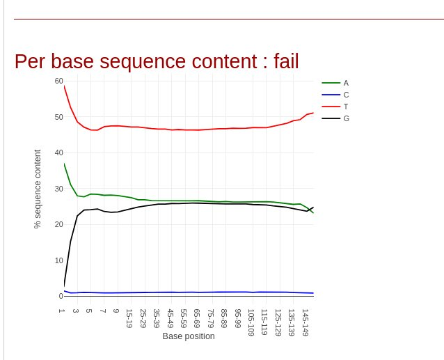

*Per-base nucleotide composition for `subset_1.fastq`. Cytosine frequency approaches zero and thymine rises to ~50% across all positions, confirming complete bisulfite conversion of the forward read.*

**Figure 02 — Per-base sequence content, Read 2:**

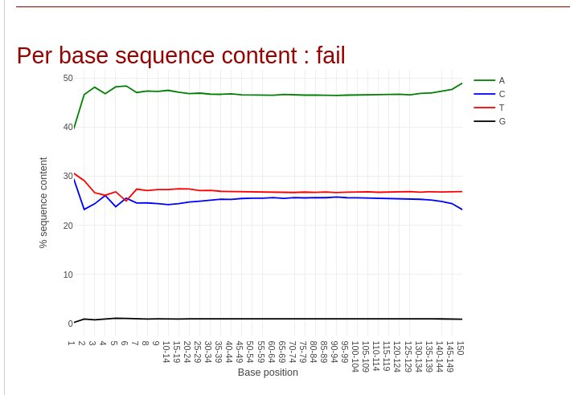

*Corresponding composition for `subset_2.fastq`. The same conversion signature is observed in the reverse read, confirming library-wide bisulfite treatment. Note the complementary pattern: G is depleted (G→A conversion on the reverse strand).*

> **Interpretation:** Both reads flag as "fail" in standard FastQC per-base sequence content — this is expected and correct for bisulfite data. The apparent imbalance is the biological signal, not a sequencing defect.

---

## Step 2 — Bisulfite-Aware Alignment (bwameth)

**Tool:** bwameth v0.2.7  
**Reference:** hg38  
**Purpose:** Align bisulfite-converted reads to the reference genome

Standard aligners (BWA-MEM, Bowtie2) fail on bisulfite reads because C→T conversion introduces apparent mismatches against an unconverted reference, dramatically reducing mapping efficiency and introducing systematic bias.

bwameth addresses this by performing in-memory 3-letter conversion of the reference genome (C→T on the forward strand; G→A on the reverse strand) and aligning reads accordingly. It handles all four bisulfite strand orientations (OT, OB, CTOT, CTOB) without requiring separate genome indices.

**Output:** Coordinate-sorted BAM file per sample, passed to MethylDackel for methylation extraction.

---

## Step 3 — Methylation Extraction and Bias Assessment (MethylDackel)

**Tool:** MethylDackel v0.5.2  
**Input:** Sorted BAM files from bwameth  
**Output:** bedGraph files with per-CpG methylation percentage and read coverage

MethylDackel traverses each aligned read and, at each CpG position, records whether the cytosine was retained (methylated) or converted to thymine (unmethylated). Output columns: chromosome, start, end, methylation %, methylated read count, unmethylated read count.

### Methylation Bias Assessment

Some bisulfite library preparation protocols introduce positional bias — artificially elevated or depressed methylation at the 5′ or 3′ ends of reads — due to end-repair artefacts. The `mbias` function plots average CpG methylation % as a function of read position to detect such biases.

**Figure 03 — Methylation bias, original top strand:**

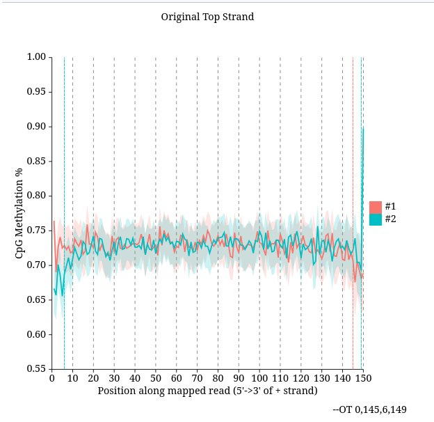

*MethylDackel mbias output for the original top strand across paired reads (#1 = Read 1, #2 = Read 2). CpG methylation is stable at 70–75% across all read positions with no significant positional trend at either terminus.*

> **Interpretation:** No end-repair bias is present. No positional trimming is required prior to methylation extraction. The slight dip at the very last positions is within the confidence interval and not actionable (see `--OT 0,145,6,149` parameters shown).

---

## Step 4 — Methylation Profiling (computeMatrix + plotProfile)

**Tools:** computeMatrix v3.5.4, plotProfile v3.5.4  
**Input:** BigWig methylation tracks, CpG island BED annotations  
**Purpose:** Visualise average methylation levels relative to genomic features

computeMatrix calculates per-base methylation signal in defined windows around genomic features — here, CpG islands and their associated transcription start sites (TSS). plotProfile renders the average methylation curve across all annotated features.

**Figure 04 — Methylation profile, single sample:**

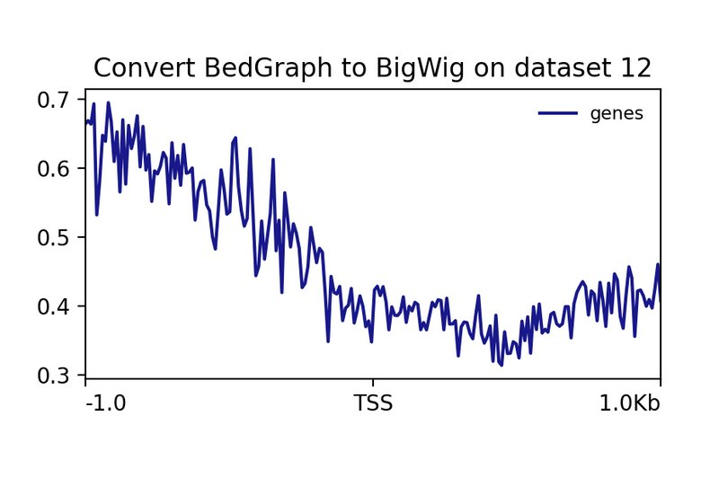

*Average CpG methylation across ±1 kb of the TSS for one sample. The characteristic dip centred on the TSS reflects biologically required hypomethylation of active promoter CpG islands — an unmethylated state permissive for transcription factor binding.*

**Figure 05 — Methylation profile, all six samples:**

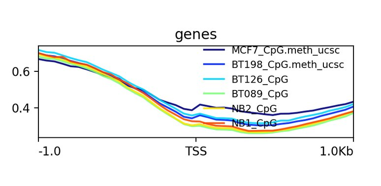

*plotProfile output across all six samples. The TSS dip is deep in normal breast tissue (NB1 in red, NB2 in yellow), reflecting intact promoter hypomethylation. In all cancer samples (BT089, BT126, BT198, MCF7 — blue shades), the dip is markedly attenuated, indicating aberrant CpG island promoter hypermethylation consistent with tumour suppressor gene silencing.*

> **Key finding:** The separation between normal and cancer samples at the TSS is striking and consistent across all four tumour samples, including the MCF7 cell line.

---

## Step 5 — DMR Detection (Metilene)

**Tool:** Metilene v0.2.6.1  
**Comparison:** Group 1 = normal breast (NB1, NB2) vs Group 2 = invasive ductal carcinoma (BT198)  
**Purpose:** Identify genomic regions with statistically significant differential methylation

Metilene applies a binary segmentation algorithm to identify contiguous CpG-dense genomic regions where the mean methylation level differs significantly between groups. Each reported DMR includes: genomic coordinates, mean methylation per group, methylation difference, q-value (Benjamini–Hochberg adjusted), CpG count, and region length in base pairs.

---

### DMR Methylation Difference Distribution

**Figure 06:**

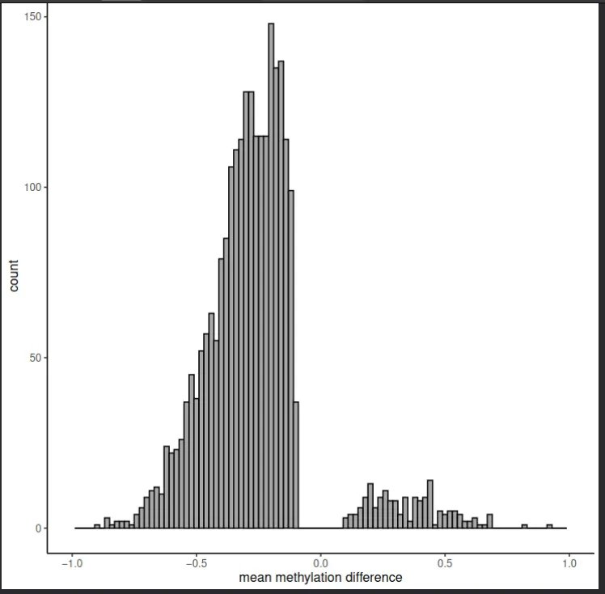

*Distribution of mean methylation differences (cancer − normal) across all detected DMRs. The distribution is strongly left-skewed, with the majority of DMRs showing negative differences (hypomethylation in cancer relative to normal).*

> **Interpretation:** Global hypomethylation is the dominant methylation change in invasive ductal carcinoma, consistent with PMD hypomethylation described in Lin et al. (2015). The smaller right-sided peak represents focal promoter hypermethylation events — fewer in number but biologically significant as candidate tumour suppressor silencing events.

---

### DMR Length Distributions

**Figure 07 — DMR length in nucleotides:**

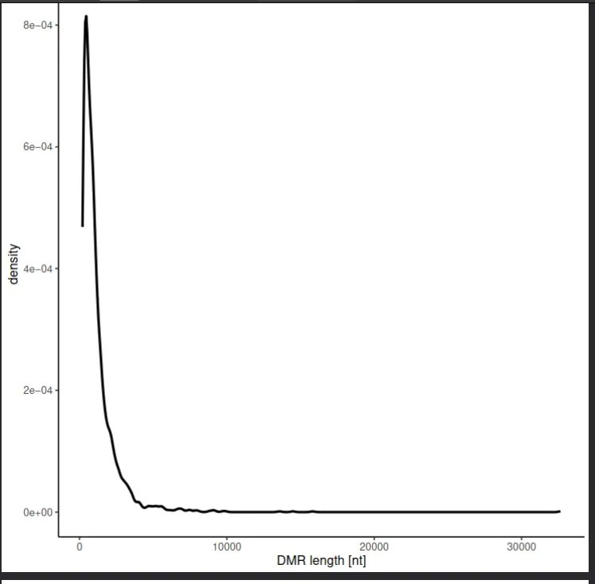

*Distribution of DMR lengths in base pairs. Most DMRs fall in the 1–3 kb range, consistent with kilobase-scale HMR expansions and contractions reported in the Lin et al. dataset. A long tail extends to >30 kb for the largest hypomethylated domains.*

**Figure 08 — DMR length in CpG count:**

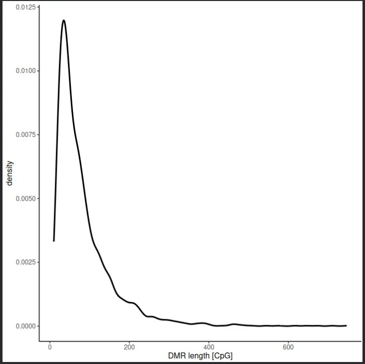

*Distribution of DMR lengths measured by number of CpG sites spanned. Peak at ~25–30 CpGs. The CpG-count distribution closely tracks the nucleotide-length distribution, as expected for regions of approximately uniform CpG density.*

---

### Statistical Significance

**Figure 09 — Mean methylation difference vs q-value:**

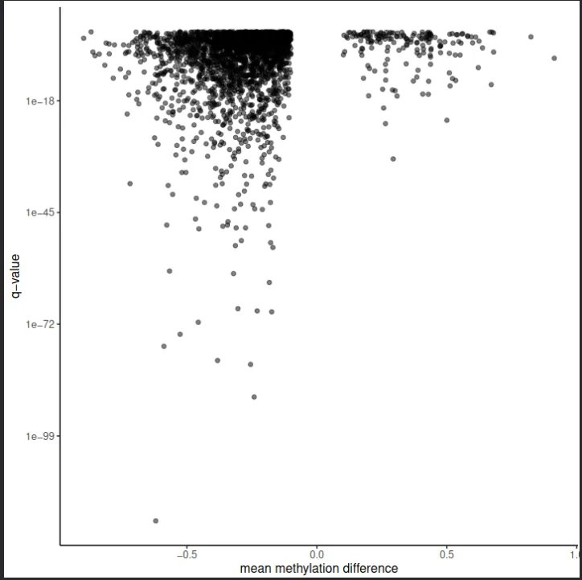

*Scatter plot of mean methylation difference vs q-value for all detected DMRs. Note the log scale on the y-axis. The most significantly differentially methylated regions — predominantly hypomethylated — reach q-values below 1×10⁻¹⁰⁰, reflecting the magnitude and consistency of methylation loss across cancer samples at these loci.*

> **Key finding:** The asymmetry is striking — hypomethylated DMRs achieve far greater statistical significance than hypermethylated ones, consistent with the large, consistent methylation losses in partially methylated domains dominating the signal.

---

### Group Methylation Comparison

**Figure 10 — Group 1 (normal) vs Group 2 (cancer) mean methylation:**

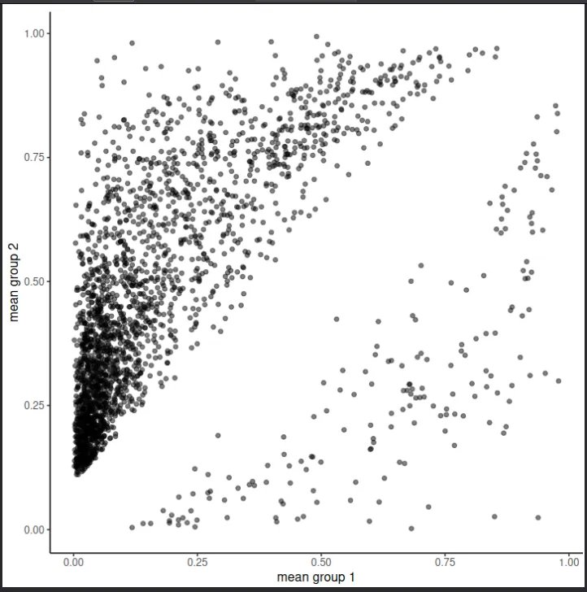

*Mean methylation in normal breast (Group 1, x-axis) vs invasive ductal carcinoma (Group 2, y-axis) at each DMR. Points on the diagonal represent no change; points below represent hypomethylation in cancer; points above represent hypermethylation in cancer.*

> **Interpretation:** The predominance of points below the diagonal, particularly for regions where normal methylation is high (x > 0.5), confirms global hypomethylation as the dominant pattern. Points above the diagonal at low normal methylation (x < 0.25) represent regions gaining methylation in cancer — the hallmark promoter hypermethylation events.

---

### DMR Size Relationship

**Figure 11 — DMR nucleotide length vs CpG count:**

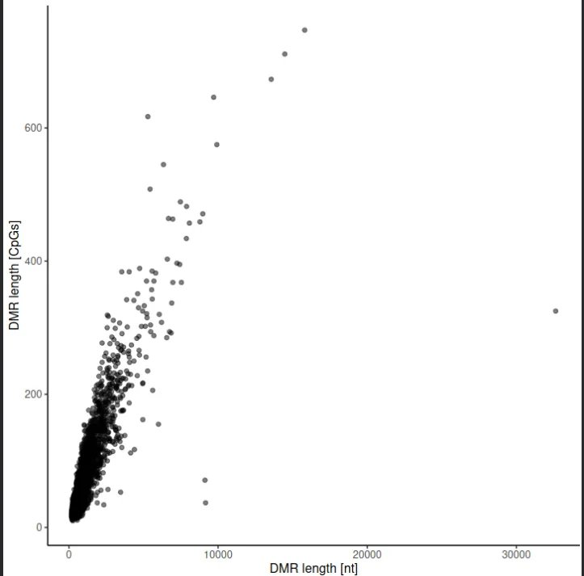

*Bivariate scatter plot of DMR nucleotide length vs CpG count. The positive linear relationship is expected — longer regions span more CpGs. Deviations above the trend line indicate CpG-dense regions (CpG islands); deviations below indicate CpG-sparse regions (gene bodies, intergenic regions).*

---

## Summary of Findings

| Step | Tool | Key Finding | Biological Interpretation |
|------|------|-------------|--------------------------|
| QC | Falco | C → ~0%, T → ~50% per base | Complete bisulfite conversion confirmed |
| Alignment | bwameth | Successful alignment to hg38 | Bisulfite-aware alignment essential for accuracy |
| Bias assessment | MethylDackel | Stable 70–75% CpG methylation across all positions | No positional artefact; no trimming required |
| Methylation profiles | plotProfile | TSS dip present in normal; attenuated in all cancer samples | Aberrant promoter CpG island hypermethylation in cancer |
| DMR detection | Metilene | Left-skewed difference distribution; q < 1×10⁻¹⁰⁰ for top DMRs | Dominant global hypomethylation in cancer, with focal hypermethylation |

These findings recapitulate the central epigenomic features of breast cancer methylomes described in Lin et al. (2015): a landscape of global hypomethylation punctuated by focal promoter hypermethylation at tumour suppressor loci.

---

## References

- Lin, I.-H. et al. (2015). Hierarchical Clustering of Breast Cancer Methylomes Revealed Differentially Methylated and Expressed Breast Cancer Genes. *PLOS ONE*, 10(2), e0118453. https://doi.org/10.1371/journal.pone.0118453
- Galaxy Training Network. DNA Methylation data analysis. https://training.galaxyproject.org/training-material/topics/epigenetics/tutorials/methylation-seq/tutorial.html
- Galaxy Europe: https://usegalaxy.eu
