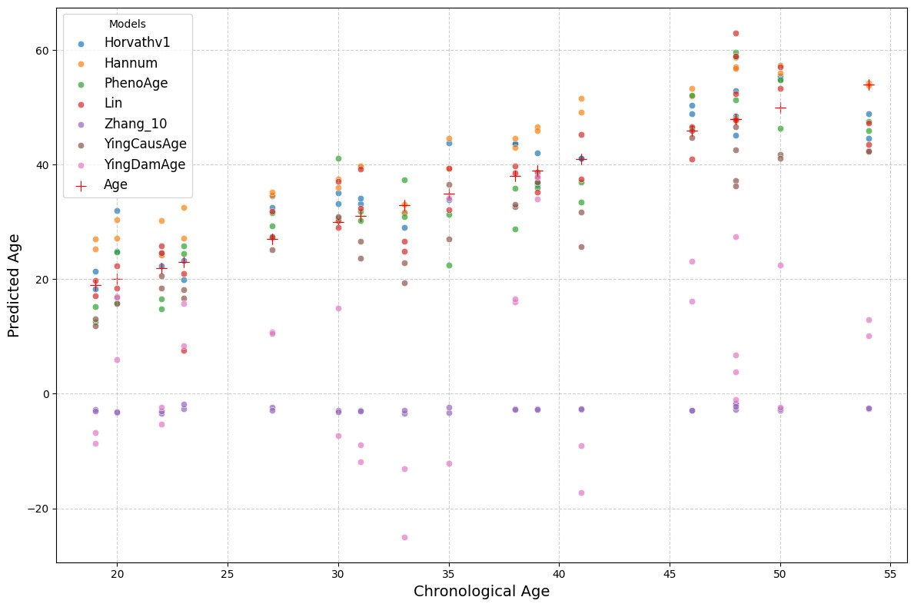
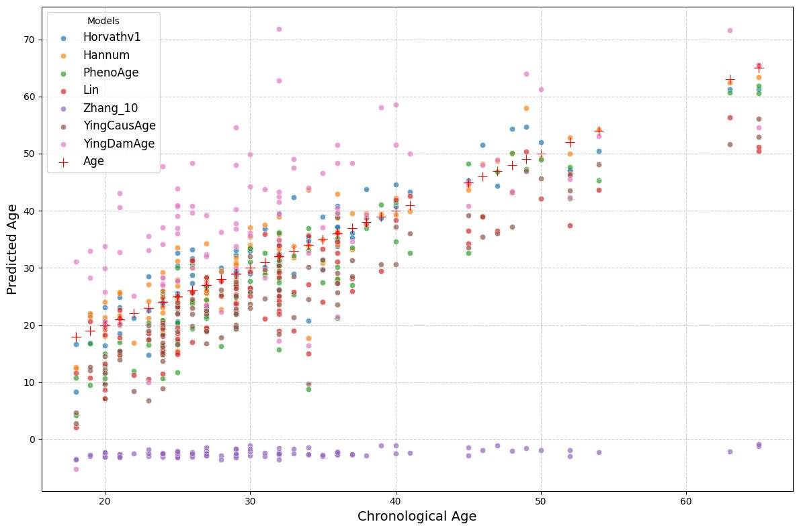

# Analysis 2 — Epigenetic Clock Benchmarking

> Benchmarking 8 epigenetic aging clocks across two independent whole-blood EPIC array datasets using the [Biolearn](https://github.com/bio-learn/biolearn) library.

---

## Table of Contents

- [Background](#background)
- [Datasets](#datasets)
- [Clocks Benchmarked](#clocks-benchmarked)
- [Methods](#methods)
- [Results](#results)
  - [Clock Correlation Structure](#clock-correlation-structure)
  - [Age Deviation Heatmaps](#age-deviation-heatmaps)
  - [Predicted vs Chronological Age](#predicted-vs-chronological-age)
  - [Mean Absolute Error Comparison](#mean-absolute-error-comparison)
  - [Predicted Age Distributions](#predicted-age-distributions)
- [Summary](#summary)
- [References](#references)

---

## Background

### Epigenetic Clocks

DNA methylation levels at specific CpG sites change systematically with age. This property underpins **epigenetic clocks** — multivariate models trained to predict biological age from methylation profiles. These clocks have evolved across three generations:

| Generation | Examples | Training Target |
|------------|----------|-----------------|
| 1st | Horvathv1, Hannum, Lin | Chronological age |
| 2nd | PhenoAge, GrimAge | Mortality / health outcomes |
| Pace | DunedinPACE | Rate of biological aging |
| Minimal | Zhang_10 | Chronological age (10 CpGs only) |

**Key question addressed here:** How well do these clocks agree with each other and with chronological age when applied to two independent healthy blood datasets?

---

## Datasets

| Dataset | GEO Accession | N | Age Range | Tissue | Array |
|---------|---------------|---|-----------|--------|-------|
| Dataset 1 | [GSE120307](https://www.ncbi.nlm.nih.gov/geo/query/acc.cgi?acc=GSE120307) | 34 | ~19–55 yr | Whole blood | Illumina EPIC 850K |
| Dataset 2 | [GSE41169](https://www.ncbi.nlm.nih.gov/geo/query/acc.cgi?acc=GSE41169) | 95 | ~18–65 yr | Whole blood | Illumina EPIC 850K |

Both datasets consist of healthy blood donors and were downloaded directly from NCBI GEO using `GEOparse`.

---

## Clocks Benchmarked

| Clock | Year | CpGs | Training Phenotype | Generation |
|-------|------|------|--------------------|------------|
| Horvathv1 | 2013 | 353 | Chronological age (pan-tissue) | 1st |
| Hannum | 2013 | 71 | Chronological age (blood) | 1st |
| Lin | 2016 | 99 | Chronological age (blood) | 1st |
| PhenoAge | 2018 | 513 | Phenotypic biological age | 2nd |
| DunedinPACE | 2022 | 173 | Pace of biological aging | Pace |
| Zhang_10 | 2019 | 10 | Chronological age (minimal model) | Minimal |
| YingCausAge | 2023 | ~1,000 | Causal biological age | 3rd |
| YingDamAge | 2023 | ~1,000 | DNA damage accumulation age | 3rd |

---

## Methods

1. **Data download** — GEO datasets retrieved via `GEOparse`; beta-value matrices extracted directly from series matrix files.
2. **Clock application** — All clocks applied using the `biolearn` Python library, which implements each clock's published CpG weights.
3. **Evaluation metrics:**
   - **MAE** (Mean Absolute Error) vs chronological age
   - **Pearson correlation** between each pair of clocks
   - **Age deviation** = predicted age − chronological age per sample
4. **Visualisation** — matplotlib/seaborn; hierarchical clustering on correlation matrices via scipy.

The complete annotated analysis notebook is available at [`notebooks/aging_clock_benchmarking.ipynb`](notebooks/aging_clock_benchmarking.ipynb).

---

## Results

### Clock Correlation Structure

The heatmaps show Pearson correlations between all clock predictions and chronological age, with hierarchical clustering to reveal clock groupings.

**Figure 01 — Correlation matrix, GSE120307 (n=34):**

**Figure 02 — Correlation matrix, GSE41169 (n=95):**

**Interpretation:**

- **1st-generation clocks** (Horvathv1, Hannum, Lin) cluster together with inter-clock correlations of r > 0.89–0.95, reflecting their shared training objective (chronological age prediction from blood methylation).
- **DunedinPACE and Zhang_10** form a separate, weakly correlated cluster. DunedinPACE is by design orthogonal — it measures the *pace* of aging (a velocity), not age itself.
- **YingCausAge and YingDamAge** correlate strongly with the 1st-generation cluster in GSE41169 (r ~0.90–0.92) but show lower agreement in GSE120307, possibly due to the smaller sample size.
- Notably, **sex** shows near-zero correlation with all clock predictions, consistent with the tissue-agnostic design of most clocks.

> The clustering pattern is highly consistent across both independent datasets, indicating these correlations reflect genuine clock architecture rather than dataset-specific noise.

---

### Age Deviation Heatmaps

Age deviation = (epigenetic age predicted by clock) − (chronological age). Blue = younger than chronological age; red = older.

**Figure 03 — Age deviation heatmap, GSE120307 (n=34):**

**Figure 04 — Age deviation heatmap, GSE41169 (n=95):**

**Interpretation:**

- **DunedinPACE** (column 4) shows the most striking pattern: systematically large negative deviations (deep blue) across nearly all samples in both datasets. This is expected — DunedinPACE returns a pace-of-aging rate (centred near 1.0 yr/yr), not an age in years, making direct comparison with chronological age misleading. The large apparent deviations are an artefact of interpreting a dimensionally different output as an age.
- **Zhang_10** shows moderate-to-large negative deviations — consistent with its extremely compressed model (10 CpGs) having high variance.
- **Horvathv1, Hannum, Lin, PhenoAge, YingCausAge** all show small, mixed deviations (±10 years), indicating reasonable agreement with chronological age in healthy blood.
- No systematic pattern of accelerated or decelerated aging is visible in these healthy cohorts, as expected.

---

### Predicted vs Chronological Age

**Figure 05 — Predicted vs chronological age, GSE120307 (n=34):**

**Figure 06 — Predicted vs chronological age, GSE41169 (n=95):**

*Red cross (+) markers = chronological age plotted on both axes (the identity line reference). Coloured dots = each clock's predicted age for that sample.*

**Interpretation:**

- **Horvathv1** (blue dots) tracks chronological age most faithfully across both datasets, clustering tightly around the identity line.
- **Hannum and Lin** (orange and red) also track chronological age well but with slightly higher variance, particularly at older ages.
- **Zhang_10** (purple) shows near-constant predictions regardless of chronological age — expected for a 10-CpG model with very limited discriminative power across the age range tested.
- **YingDamAge** (pink) produces the widest spread, including predictions below zero for some samples, suggesting it is poorly calibrated for this age range or tissue type.
- **DunedinPACE** (lavender) clusters near zero, consistent with its output being a rate rather than an age.
- The GSE41169 dataset (n=95, wider age range) better reveals the tracking behaviour of each clock across the human lifespan.

---

### Mean Absolute Error Comparison

**Figure 07 — MAE per clock across both datasets:**

| Clock | MAE (GSE120307) | MAE (GSE41169) | Notes |
|-------|-----------------|----------------|-------|
| Horvathv1 | ~4 yr | ~3 yr | Best overall performer |
| Hannum | ~6 yr | ~3 yr | Better on larger dataset |
| PhenoAge | ~5 yr | ~6 yr | Consistent across datasets |
| Lin | ~5 yr | ~6 yr | Consistent across datasets |
| YingCausAge | ~6 yr | ~7 yr | — |
| Zhang_10 | ~38 yr | ~34 yr | Extreme compression penalty |
| YingDamAge | ~30 yr | ~11 yr | Strong dataset dependence |
| DunedinPACE | — | — | Not meaningful in age units |

**Interpretation:**

- **Horvathv1 is the most accurate chronological age predictor** in both datasets (~3–4 yr MAE), despite being published in 2013. Its pan-tissue training set and large CpG set (353 sites) give it robust generalisation.
- **Zhang_10's MAE of ~38 years** illustrates the severe cost of extreme CpG compression. While useful in settings where array data is unavailable, it cannot serve as a precise age predictor.
- **YingDamAge's high MAE on GSE120307** (n=34) may partly reflect the small sample size amplifying individual-level variance.
- **DunedinPACE** should not be evaluated on MAE against chronological age — its output is dimensionally different.

---

### Predicted Age Distributions

**Figure 08 — Predicted age distributions across all clocks (both datasets):**

*Box plots of the predicted age distributions per clock. The red dashed line marks the mean chronological age of each cohort.*

**Interpretation:**

- **Horvathv1, Hannum, Lin, PhenoAge, and YingCausAge** produce distributions centred close to the cohort mean chronological age (red dashed line), indicating good calibration in healthy blood.
- **Zhang_10** is a clear outlier in GSE120307 — its median prediction is near **zero**, with a very tight distribution, confirming severe miscalibration of the minimal 10-CpG model on this dataset. Performance improves in GSE41169 but remains unreliable.
- **YingDamAge** shows the widest spread and the largest outliers in both datasets, consistent with the high MAE observed in Figure 07.
- **DunedinPACE** clusters tightly near zero in both panels, reflecting its pace-of-aging output (expected ≈ 1.0 yr/yr, not a year-scale age), plotted here on the chronological age axis for completeness.
- The narrower interquartile ranges of Horvathv1, Hannum, and Lin across both datasets reflect their robust calibration across the human adult age range.

---

## Summary

| Metric | Finding |
|--------|---------|
| Clock correlations | 1st-generation clocks (Horvathv1, Hannum, Lin) r > 0.90; DunedinPACE orthogonal to all |
| Age deviations | Most clocks within ±10 yr; Zhang_10 and DunedinPACE are systematic outliers |
| MAE | Horvathv1 best (~4 yr); Zhang_10 worst (~38 yr on GSE120307) |
| Reproducibility | All patterns replicated across both independent datasets (n=34 and n=95) |
| Key insight | Clock accuracy scales with CpG count and training sample size; extreme compression (Zhang_10) incurs a severe accuracy penalty; pace clocks (DunedinPACE) should not be compared on chronological age MAE |

---

## References

1. Ying, K. et al. (2023). Biolearn, an open-source library for biomarkers of aging. *bioRxiv*. https://doi.org/10.1101/2023.12.02.569722
2. Horvath, S. (2013). DNA methylation age of human tissues and cell types. *Genome Biology*, 14, R115.
3. Hannum, G. et al. (2013). Genome-wide methylation profiles reveal quantitative views of human aging rates. *Molecular Cell*, 49(2), 359–367.
4. Lin, Q. et al. (2016). Differentiation of human NK cells from hematopoietic stem cells. *Scientific Reports*.
5. Levine, M.E. et al. (2018). An epigenetic biomarker of aging for lifespan and healthspan. *Aging*, 10(4), 573–591.
6. Belsky, D.W. et al. (2022). DunedinPACE, a DNA methylation biomarker of the pace of aging. *eLife*, 11, e73420.
7. Zhang, Q. et al. (2019). Improved precision of epigenetic clock estimates across tissues and its implication for biological ageing. *Genome Medicine*, 11, 54.
8. Ying, K. et al. (2024). Causal epigenetic age uncouples damage and adaptation. *Nature Aging*, 4, 231–248.
