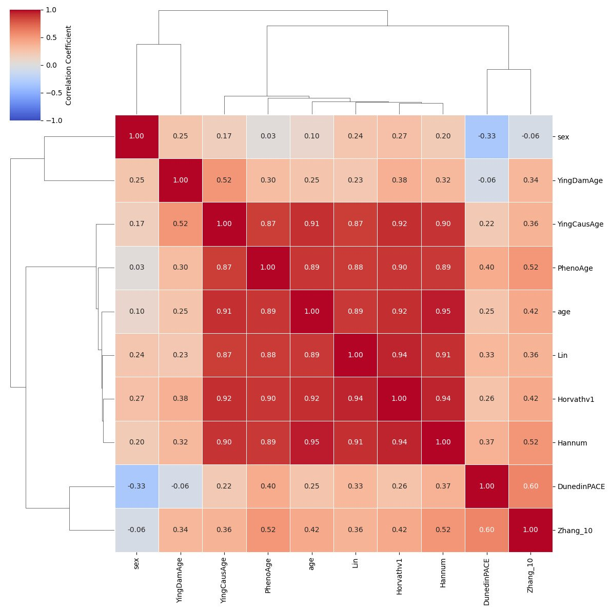
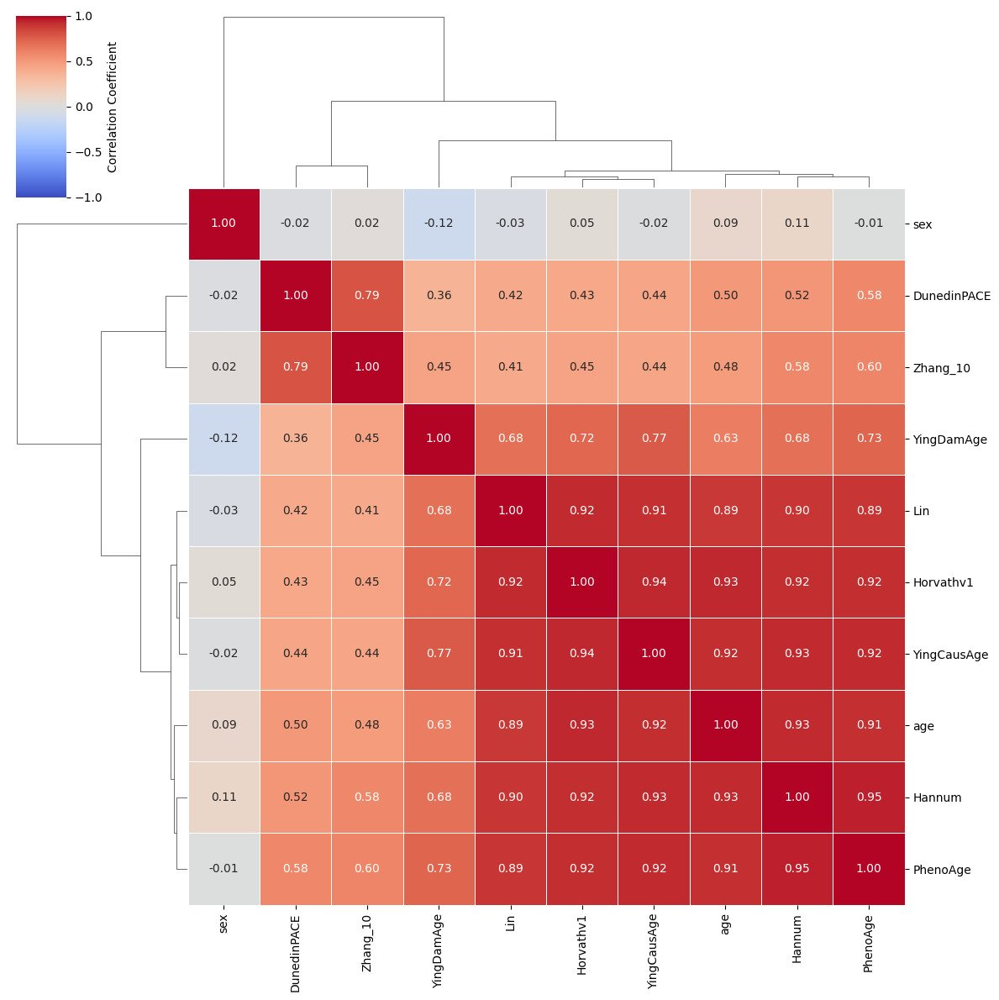
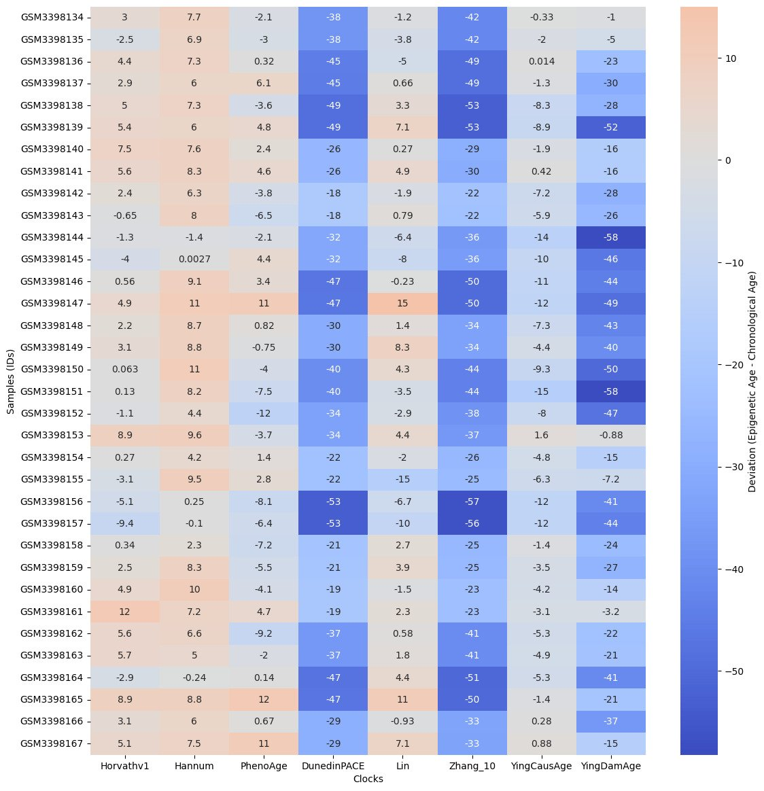
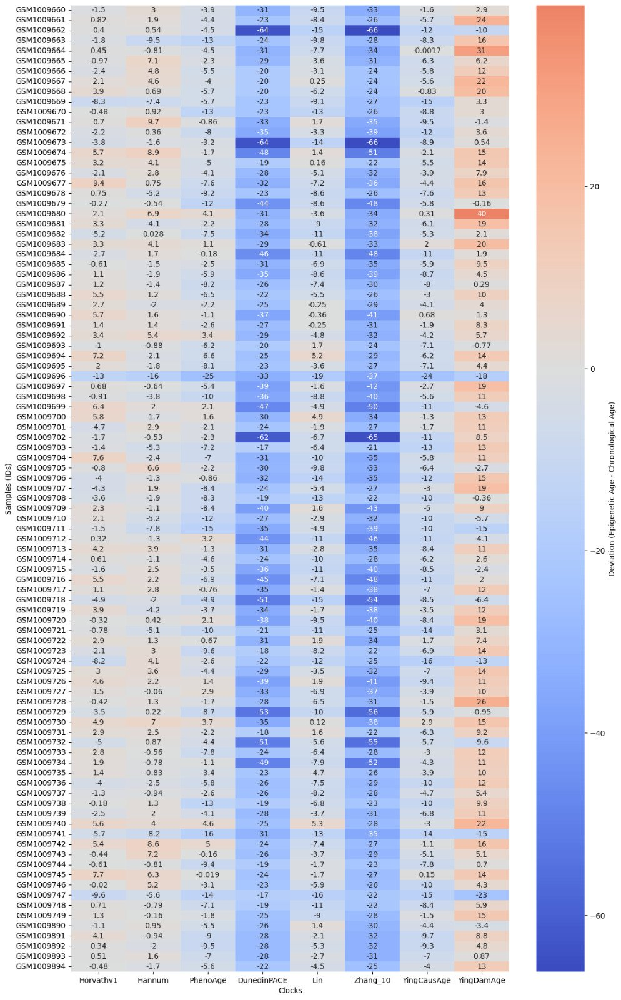
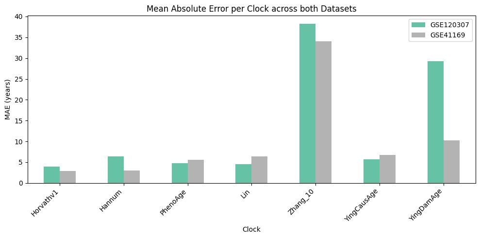
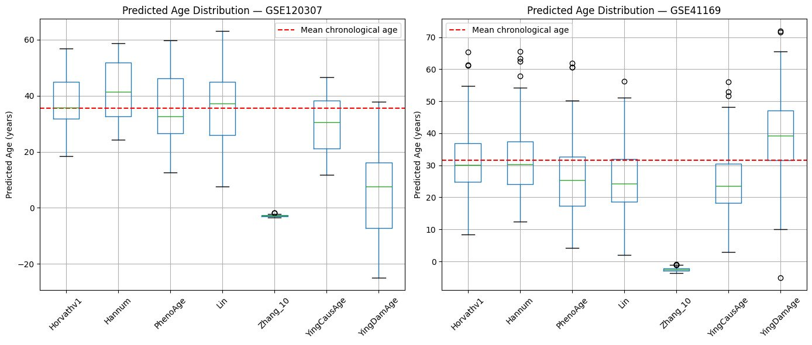

# DNA Methylation Analysis

> **Whole-Genome Bisulfite Sequencing in Breast Cancer · Epigenetic Clock Benchmarking**

[](LICENSE)
[](https://usegalaxy.eu)
[](https://colab.research.google.com)
[](https://www.python.org)
[]()

---

## Overview

This repository contains two independent but complementary DNA methylation analyses:

| Analysis | Method | Platform | Goal |
|----------|--------|----------|------|
| [01 — WGBS Breast Cancer](01_wgbs_breast_cancer/) | Whole-Genome Bisulfite Sequencing | Galaxy Europe | Reproduce differential methylation findings from Lin et al. (2015) between breast cancer and normal tissue |
| [02 — Epigenetic Clocks](02_epic_array_aging_clocks/) | Illumina EPIC 850K Array | Google Colab + Biolearn | Benchmark 8 epigenetic aging clocks across two independent blood methylation datasets |

---

## Repository Structure

```
dna-methylation-analysis/
│
├── 01_wgbs_breast_cancer/              # WGBS pipeline — breast cancer vs normal
│   ├── data/
│   │   ├── raw/                        # Download scripts / SRA accessions
│   │   └── processed/                  # Aligned BAMs, methylation BED files
│   ├── scripts/                        # Shell wrappers for each pipeline step
│   ├── figures/                        # All output figures (11 plots)
│   └── README.md
│
├── 02_epic_array_aging_clocks/         # Epigenetic clock benchmarking
│   ├── data/                           # GEO download scripts + sample metadata
│   ├── notebooks/
│   │   └── aging_clock_benchmarking.ipynb│   ├── scripts/                        # Modular Python scripts
│   ├── scripts/
│   ├── figures/                        # All output plots (8 plots)
│   └── README.md
|
├── ci.yml            # GitHub Actions: environment validation
├── .gitignore
├── environment.yml                     # Conda environment (Analysis 2)
├── requirements.txt                    # pip dependencies
├── LICENSE
└── README.md                           ← you are here
```

---

## Background

### DNA Methylation

DNA methylation is a covalent epigenetic modification in which a methyl group (—CH₃) is added to the C5 position of cytosine residues at CpG dinucleotides, catalysed by DNA methyltransferase (DNMT) enzymes. It plays central roles in:

- Transcriptional silencing of promoters
- Genomic imprinting and X-chromosome inactivation
- Maintenance of genome stability
- Developmental gene regulation

### Methylation in Cancer

Cancer genomes display characteristic, opposing methylation changes:

| Type | Location | Effect |
|------|----------|--------|
| **Hypermethylation** | Promoter CpG islands | Silencing of tumour suppressor genes |
| **Hypomethylation** | Gene bodies, repetitive elements | Genomic instability, oncogene activation |

### Epigenetic Clocks

Systematic age-associated CpG methylation changes underpin **epigenetic clocks** — multivariate regression models that predict biological age from methylation profiles at a curated set of CpG sites. These clocks span three generations:

- **1st generation** (Horvathv1, Hannum, Lin): trained to predict chronological age
- **2nd generation** (PhenoAge, GrimAge): trained to predict health/mortality outcomes
- **Pace clocks** (DunedinPACE): trained to capture the *rate* of aging, not age itself

---

## Analysis 1 — WGBS Breast Cancer Pipeline

**Reference:** Lin et al. (2015), *PLOS ONE*  
**Platform:** [Galaxy Europe](https://usegalaxy.eu)  
**Directory:** [`01_wgbs_breast_cancer/`](01_wgbs_breast_cancer/)

### Pipeline

```
Raw FASTQ Reads
       │
       ▼
Quality Control ──────────────────── Falco v1.2.4
       │
       ▼
Bisulfite-Aware Alignment ─────────── bwameth v0.2.7 → GRCh38/hg38
       │
       ▼
Methylation Extraction + Bias ─────── MethylDackel v0.5.2
       │
       ▼
Methylation Profiling ─────────────── computeMatrix + plotProfile v3.5.4
       │
       ▼
DMR Detection ─────────────────────── Metilene v0.2.6.1
```

### Key Results

**Bisulfite conversion confirmed** — cytosine drops to ~0%, thymine rises to ~50% in both reads:

| Read 1 | Read 2 |
|--------|--------|
|  |  |

**No methylation extraction bias** — CpG methylation stable at 70–75% across all read positions:


**TSS hypomethylation attenuated in cancer** — promoter CpG islands gain methylation in tumour samples:

| Single sample | All six samples |
|---------------|-----------------|
|  |  |

**Global hypomethylation dominates in cancer** — left-skewed DMR distribution; top DMRs reach q < 1×10⁻¹⁰⁰:

| Methylation difference distribution | q-value vs difference |
|-------------------------------------|----------------------|
|  |  |

| Group 1 vs Group 2 methylation | DMR length (nt) vs CpG count |
|--------------------------------|------------------------------|
|  |  |

→ Full documentation: [`01_wgbs_breast_cancer/README.md`](01_wgbs_breast_cancer/README.md)

---

## Analysis 2 — Epigenetic Clock Benchmarking

**Library:** [Biolearn](https://github.com/bio-learn/biolearn)  
**Platform:** Google Colab  
**Directory:** [`02_epic_array_aging_clocks/`](02_epic_array_aging_clocks/)

### Datasets

| Dataset | GEO Accession | N | Tissue | Array |
|---------|---------------|---|--------|-------|
| Dataset 1 | [GSE120307](https://www.ncbi.nlm.nih.gov/geo/query/acc.cgi?acc=GSE120307) | 34 | Whole blood | Illumina EPIC 850K |
| Dataset 2 | [GSE41169](https://www.ncbi.nlm.nih.gov/geo/query/acc.cgi?acc=GSE41169) | 95 | Whole blood | Illumina EPIC 850K |

### Key Results

**Clock correlation structure** — 1st-generation clocks cluster tightly (r > 0.90); DunedinPACE is orthogonal:

| GSE120307 | GSE41169 |
|-----------|----------|
|  |  |

**Predicted vs chronological age** across both datasets:

| GSE120307 (n=34) | GSE41169 (n=95) |
|------------------|-----------------|
|  |  |

**Mean Absolute Error comparison** — Horvathv1 most accurate (~4 yr); Zhang_10 worst (~38 yr):



**Predicted age distributions** — most clocks centred on cohort mean; Zhang_10 badly miscalibrated on GSE120307 (median near zero):



→ Full documentation: [`02_epic_array_aging_clocks/README.md`](02_epic_array_aging_clocks/README.md)

---

## Key Results Summary

### WGBS (Analysis 1)

| Step | Finding |
|------|---------|
| QC | Complete bisulfite conversion in all 6 samples |
| Bias assessment | Stable 70–75% CpG methylation; no positional artefacts |
| Methylation profiles | TSS hypomethylation intact in normal; attenuated in all cancer samples |
| DMR detection | Dominant global hypomethylation; top DMRs q < 1×10⁻¹⁰⁰ |

### Epigenetic Clocks (Analysis 2)

| Metric | Finding |
|--------|---------|
| Clock correlations | 1st-generation clocks r > 0.90; DunedinPACE orthogonal to all |
| Age deviations | Most clocks within ±10 years; Zhang_10 and DunedinPACE are outliers |
| MAE | Horvathv1 lowest (~4 yr); Zhang_10 highest (~38 yr on GSE120307) |
| Reproducibility | Patterns replicated across both independent blood datasets |

---

## Installation & Dependencies

### Analysis 1 — Galaxy Europe (no local install required)

Run through the [Galaxy Training Network WGBS tutorial](https://training.galaxyproject.org/training-material/topics/epigenetics/tutorials/methylation-seq/tutorial.html) on [usegalaxy.eu](https://usegalaxy.eu).

| Tool | Version |
|------|---------|
| Falco | 1.2.4 |
| bwameth | 0.2.7 |
| MethylDackel | 0.5.2 |
| computeMatrix / plotProfile (deepTools) | 3.5.4 |
| Metilene | 0.2.6.1 |

### Analysis 2 — Python

**Option A: Conda (recommended)**
```bash
conda env create -f environment.yml
conda activate dna-methylation
```

**Option B: pip**
```bash
pip install biolearn pandas numpy matplotlib seaborn GEOparse
```

Minimum Python version: **3.9+**

---

## Reproducing the Analyses

### Analysis 1 (WGBS)

1. Navigate to [usegalaxy.eu](https://usegalaxy.eu) and create a free account.
2. Import the public history via the Galaxy Training Network tutorial link.
3. Run the workflow on the sample accessions in `01_wgbs_breast_cancer/data/raw/`.

### Analysis 2 (Epigenetic Clocks)

```bash
git clone https://github.com/fafzal31/Epigenetics-and-Aging-Analysis.git
cd Epigenetics-and-Aging-Analysis
pip install -r requirements.txt
python 02_epic_array_aging_clocks/scripts/download_data.py
jupyter notebook 02_epic_array_aging_clocks/notebooks/aging_clock_benchmarking.ipynb
```

[](https://colab.research.google.com)

---

## Data Availability

| Dataset | Source | Access |
|---------|--------|--------|
| WGBS breast cancer samples | SRA / Lin et al. (2015) — E-MTAB-2014 | Public |
| GSE120307 (blood EPIC, n=34) | NCBI GEO | Public |
| GSE41169 (blood EPIC, n=95) | NCBI GEO | Public |
| Reference genome hg38 | UCSC / Ensembl | Public |

No raw data files are stored in this repository.

---

## Citations

1. **Lin, I.-H. et al.** (2015). Hierarchical Clustering of Breast Cancer Methylomes Revealed Differentially Methylated and Expressed Breast Cancer Genes. *PLOS ONE*, 10(2), e0118453. https://doi.org/10.1371/journal.pone.0118453
2. **Ying, K. et al.** (2023). Biolearn, an open-source library for biomarkers of aging. *bioRxiv*. https://doi.org/10.1101/2023.12.02.569722
3. **Horvath, S.** (2013). DNA methylation age of human tissues and cell types. *Genome Biology*, 14, R115. https://doi.org/10.1186/gb-2013-14-10-r115
4. **Hannum, G. et al.** (2013). Genome-wide methylation profiles reveal quantitative views of human aging rates. *Molecular Cell*, 49(2), 359–367.
5. **Levine, M.E. et al.** (2018). An epigenetic biomarker of aging for lifespan and healthspan. *Aging*, 10(4), 573–591.
6. **Belsky, D.W. et al.** (2022). DunedinPACE, a DNA methylation biomarker of the pace of aging. *eLife*, 11, e73420.
7. **Galaxy Training Network.** DNA Methylation data analysis. https://training.galaxyproject.org

---

## License

MIT License — see [LICENSE](LICENSE) for details.

---

<div align="center"><i>Questions or issues? Open a <a href="https://github.com/FaiqaZarar/dna-methylation-analysis/issues">GitHub Issue</a>.</i></div>
